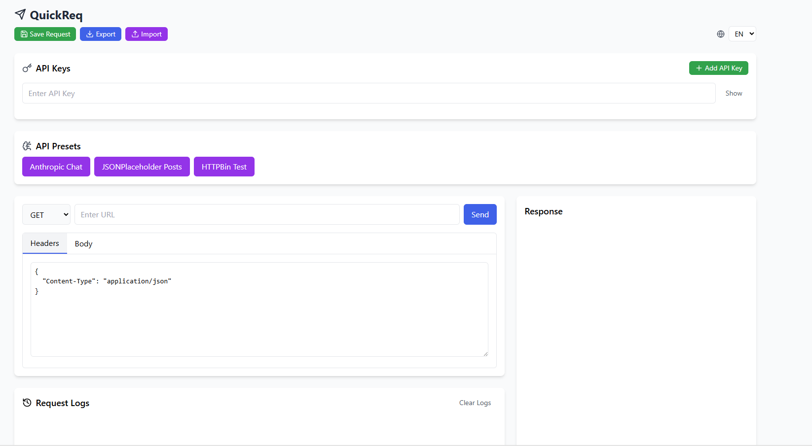

# QuickReq

**A fast, lightweight API client for developers.**

QuickReq is a minimal, local-first REST API testing tool built with React and TypeScript.  
No accounts. No cloud sync. No unnecessary complexity.

Just send requests. Get responses. Move on.




## 🚀 Why QuickReq?

Most API tools are powerful — but heavy.

QuickReq focuses on:
- ⚡ **Speed** - Instant startup, no loading screens
- 🧠 **Simplicity** - Clean interface, zero learning curve  
- 🔐 **Local storage only** - Your data never leaves your machine
- 🧩 **Zero lock-in** - Export/import your requests anytime

If you just need to test an endpoint quickly, this is for you.

## ✨ Features

- ✅ Supports GET, POST, PUT, DELETE, PATCH
- ✅ JSON header & body editor
- ✅ Response status & timing display
- ✅ Request history
- ✅ Save frequently used requests
- ✅ API key management
- ✅ Import / export configuration
- ✅ English & Dutch language support
- ✅ 100% local storage (no external tracking)

## 📦 Installation

### Quick Start (Windows)
1. Download or clone this repository
2. Double-click `start.bat`
3. Done! QuickReq will install and launch automatically

### Manual Installation
```bash
git clone https://github.com/yourname/quickreq.git
cd quickreq
npm install
npm run dev
```

## 🎯 Quick Usage

1. **Enter URL** - Type your API endpoint
2. **Select Method** - Choose GET, POST, etc.
3. **Add Headers** - JSON format in the Headers tab
4. **Add Body** - Request payload in the Body tab
5. **Send** - Click send and see the response

### API Key Management
- Add your API keys in the "API Keys" section
- Save them with memorable names
- Keys are stored locally and can be hidden/shown
- Use presets for popular APIs (Anthropic, etc.)

### Save & Reuse
- Save frequently used requests
- View automatic request history
- Export/import for backup or sharing

## 🛠 Built With

- **React 18** - Modern React with hooks
- **TypeScript** - Type safety and better DX
- **Vite** - Fast build tool and dev server
- **Tailwind CSS** - Utility-first styling
- **Lucide React** - Beautiful icons

## 🧩 Philosophy

QuickReq is intentionally small.

- It is **not** trying to replace Postman
- It **is** designed for fast iteration and quick debugging
- Local-first: your data stays on your machine
- Zero configuration: works out of the box
- Minimal dependencies: fast and reliable

## 🌍 Internationalization

Currently supports:
- 🇺🇸 English (default)
- 🇳🇱 Dutch

Want to add your language? Check `/docs/I18N_GUIDE.md`

## 📚 Documentation

- [`/docs/ARCHITECTURE.md`](docs/ARCHITECTURE.md) - System architecture
- [`/docs/ADDING_FEATURES.md`](docs/ADDING_FEATURES.md) - Development guide
- [`/docs/I18N_GUIDE.md`](docs/I18N_GUIDE.md) - Translation guide
- [`/docs/STORAGE_MODEL.md`](docs/STORAGE_MODEL.md) - Data storage

## 🤝 Contributing

Pull requests are welcome!

If you want to:
- Add new API presets
- Improve logging
- Add languages
- Optimize UX

Check the `/docs` folder first for development guides.

### Development Setup
```bash
npm install
npm run dev
```

## 🔒 Privacy & Security

- **No tracking** - Zero analytics or external calls
- **Local storage** - All data stays in your browser
- **No accounts** - No sign-up required
- **Open source** - Audit the code yourself

## 📄 License

MIT License - see [LICENSE](LICENSE) file for details.

---

**Made with ❤️ for developers who value simplicity**